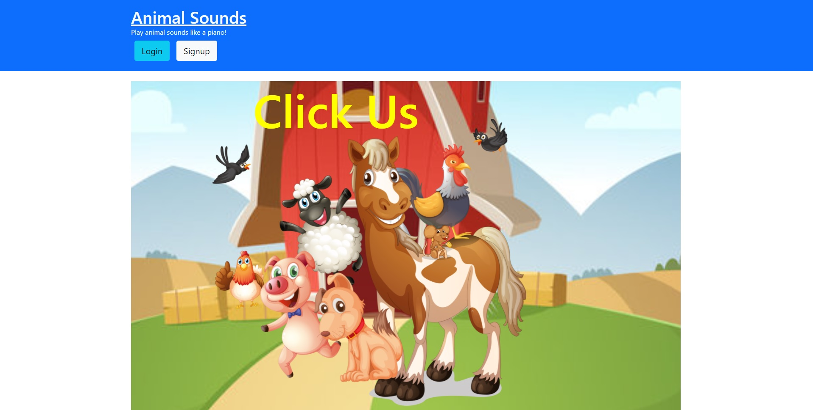

# Barnyard Symphony

## Screenshot

## Live Link

[Live portfolio URL](https://fierce-beyond-80772.herokuapp.com/)

## Table of Contents

- [Description](#description)
- [Installation](#installation)
- [Usage](#usage)
- [Tests](#tests)
- [Contributing](#contributing)
- [Questions](#questions)

 ## Description

The purpose of the application is to The purpose of this application is a allow a logged in user to view and hear the sounds that they might see on a farm. The user will be able to also save their favorite animals as well as play the animal sounds across a three octave keyboard.
 
## Installation

This application is deployed

## Usage

Login with username of TEST@TEST.COM and a password of test1234. The animals tab takes you inside the barn to view different animals. Here you can play as well well as save your favorite animals and their sounds. The play tab takes you to your list of saved animals. The home tab takes you back outside, where if you click on the image of the animals you are taken to a keyboard to play their noises at will

## Tests

Front end still needs to be updated, and the mp3s should be altered to be more different from eachother

## Contributing

Please Don't 

## Questions

My GitHub username is: karpx033

Link @ https://github.com/karpx033

Email: karxp033@gmail.com

Got Questions? 
Send me an email

